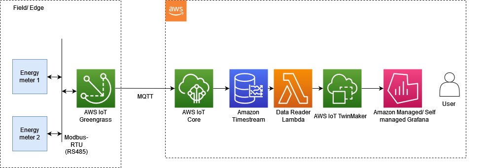

## IoT Accelerator - Energy Monitoring for Digital Twins

This is an accelerator for creating an energy monitoring solution for digital twins with AWS IoT. This accelerator consists of a AWS Cloud Formation template which creates and configures the AWS services required to deploy data ingestion, storage and 3D visualization components that are required for a energy monitoring solution in a digital twin.  The solution outline is as follows:

#### Prerequisites:
- On site (field) device which can publish the data read from energy meters to an MQTT topic in IoT Core
- AWS account with privileges to create the services used in this solution listed below.
#### Features:
 - AWS IoT Core ingests the uplink energy meter readings from the field device via MQTT
 - Amazon Timestream stores the timeseries data
 - AWS IoT TwinMaker provides the capability to build 3D model and entity hierarchy of the digital twin and bind the data stored in Timestream to these entities. 
 - Amazon Managed Grafana provides a flexible, no-code builder for the user to build a custom dashboard.

#### Architecture

#### Instructions:
- Upload the cloud formation template *energy-monitoring.json* to your AWS Cloud formation console page. Give your solution stack a name of your choice.
- Enter the MQTT topic in IoT Core that your device would publish the energy meter data to.
- Provision the template. This may take ~5mins. Upon successful provisioning follow the last few steps below.
- In the console, go to IoT Core > Message routing > Rules and activate the rule that was just created during the provisioning
- In the console, go to AWS IoT TwinMaker, select the workspace that was created during provisioning > Dashboard settings > Modify. 
	- Select 'Amazon Managed Grafana'
	- In the 'Grafana authentication provider' drop down, select the role [your solution stack name]_GrafanaServiceRole-xxxxxxx
	- Click Next
	- In the 'Dashboard role' dropdown, select the role [your solution stack name]_DashboardRole-xxxxx
	- Next and Save changes
- In the console, go to Amazon Grafana and select the work space that was just created during the provisioning.
	- Go to 'Authentication', enable AWS IAM Identity Center
	- Click 'Configure Users and user groups'. This will show the users configured in AWS IAM Identity center. If you cannot see any user there, go to AWS IAM Identity Center in the console and create a user.
	- Select the user in the list and assign the user and make the user an Admin in the Grafana page.

At this point all the services that are needed for the solution are ready for use. The next step is to perform some basic testing for the data flow. Navigate to IoT Core > MQTT test client. Publish a message which looks like below:
```
	{
	  "panelId": "mech-rooftop",
	  "meterId": 5,
	  "v1": 246.55,
	  "i1": 0,
	  "kW": 0
	}
```
It is important to note the format of the message expected by IoT Core. Each reading should consist of the meterId where this reading came from, and the panelId where the meter is located in. At minimum, there should be the v1, i1, and kW properties in the json.  Of course all this is totally configurable using IoT Core Rules engine. eg: if you are reading a 3-phase meter, it is as simple as adding v2, v3, i2, i3 to the SQL query in the IoTToTimestream rule.

If everything goes as planned, the message t hat was published from the MQTT test client should be stored in Timestream. Navigate to Amazon Timestream page and verify if the data exists.

Next step is to create the digital twin of your facility eg: factory, building. 
- Navigate to AWS IoT TwinMaker > your workspace > entities and create your grouping of panels.  	
- In each panel, add a component of type *com.example.energymeter* for each energy meter in the panel. You will be required to fill in the meterId and panelId for each component you create. This hierarchy of entities, is the *Model* of your digital twin.
- Now we need to create the scene. Navigate to the Resources page in TwinMaker and upload any 3D files you need for your 3D scene.
- Navigate to the Scenes page in TwinMaker and compose your scene with the 3D resources.

Last but not least, navigate to Amazon Grafana and start building your dashboard!
